<div align="center">

<h1>📚 RAG Practice: 全栈 RAG 知识库与评测系统实践</h1>

<p style="margin-top: 10px;">
  
  
  
  
</p>

<p>
  <a href="#-项目简介">项目简介</a> •
  <a href="#-核心特性">核心特性</a> •
  <a href="#-系统架构">系统架构</a> •
  <a href="#-技术栈">技术栈</a> •
  <a href="#-快速开始">快速开始</a> •
  <a href="#-局限性与已知问题-limitations">局限性</a> •
  <a href="#-贡献与交流">交流与贡献</a>
</p>

</div>
---
## 📖 项目简介

**RAG Practice** 是一个尝试将 RAG 理论转化为代码的工程实践。与简单的 Demo 不同，本项目致力于探索 RAG 系统中从简单的向量检索走向生产级系统的过程中遇到的实际问题。

项目核心关注点在于：

1. **数据处理精细度**：使用 Docling 探索复杂文档（PDF）的解析与语义切片。
    
2. **检索策略优化**：摒弃单一向量检索，实现基于 Elasticsearch 的 **Hybrid Search (向量 + 关键词)** 与 **RRF (倒数排名融合)**。
    
3. **闭环评估体系**：集成 Ragas 和 Langfuse，构建“生成测试集 -> 运行实验 -> 量化指标”的自动化评估闭环。
    
4. **工程化实践**：实现异步任务队列、限流、权限管理及容器化部署。
    

## ✨ 核心特性

### 🧠 高级检索与生成

- **混合检索 (Hybrid Search)**: 结合 Dense Vector (语义) 与 Sparse BM25 (关键词) 检索，解决专有名词匹配不准的问题。
    
- **重排序 (Rerank)**: 集成 TEI (Text Embeddings Inference) 对召回结果进行二次精排。
    
- **查询重写 (Query Rewrite)**: 将多轮对话上下文重写为独立查询，提升检索准确率。
    

### 📄 数据摄取 (Ingestion)

- **文档解析**: 采用 [Docling](https://github.com/DS4SD/docling) 处理 PDF 文档，尝试保留文档层级结构。
    
- **异步处理**: 基于 Redis + Arq 构建非阻塞的文档解析与向量化管道。
    
- **父子索引 (Parent-Child Indexing)**: 实现 Small-to-Big 策略，利用小切片检索，大窗口生成。
    

### 📊 评估与可观测性 (Evaluation & Ops)

- **自动化评测**: 集成 **Ragas**，支持 Faithfulness, Answer Relevancy 等指标的自动化计算。
    
- **全链路追踪**: 接入 **Langfuse**，实现从检索到生成的全链路 Trace 和 Token 消耗监控。
    

## 🖼️ Screenshots

![[Pasted image 20251210202209.png]]

<center> 主页面 </center>

********

![[Pasted image 20251210201852.png]]

![[Pasted image 20251210201913.png]]

<center>权限管理/文件上传</center>

********

![[Pasted image 20251211010847.png]]

<center>查看来源和页码/显示reranker的置信度</center>

![[Pasted image 20251211010944.png]]

<center>多知识库召回/调节返回Topk</center>

********

## 🛠️ 技术栈

|**模块**|**技术选型**|**说明**|
|---|---|---|
|**后端框架**|FastAPI|高性能 Python Web 框架|
|**ORM**|SQLModel (PostgreSQL)|现代化的数据库交互|
|**LLM 编排**|LangChain|核心逻辑编排|
|**文档处理**|Docling|深度 PDF 解析与 OCR 支持|
|**向量数据库**|Elasticsearch (8.17.0)|支持向量与全文检索的混合查询|
|**Rerank**|HuggingFace TEI|本地部署 BGE-Reranker 模型|
|**任务队列**|Arq + Redis|处理耗时任务（解析、评测）|
|**对象存储**|MinIO|存储原始文档文件|
|**可观测性**|Langfuse|LLM Ops 监控与 Trace|
|**评测框架**|Ragas|RAG 性能量化评估|

## 🏗️ 系统架构

```mermaid
%%{init: {'theme': 'base', 'themeVariables': { 'primaryColor': '#ffcc00', 'edgeLabelBackground':'#ffffff', 'tertiaryColor': '#f4f4f4', 'fontFamily': 'Inter, sans-serif'}}}%%
flowchart TD
    %% 样式定义
    classDef client fill:#E3F2FD,stroke:#1565C0,stroke-width:2px,color:#0D47A1,rx:10,ry:10;
    classDef api fill:#E8F5E9,stroke:#2E7D32,stroke-width:2px,color:#1B5E20,rx:10,ry:10;
    classDef worker fill:#FFF8E1,stroke:#FBC02D,stroke-width:2px,color:#F57F17,rx:5,ry:5;
    classDef db fill:#F3E5F5,stroke:#7B1FA2,stroke-width:2px,color:#4A148C;
    classDef model fill:#FFEBEE,stroke:#C62828,stroke-width:2px,color:#B71C1C,rx:5,ry:5;
    classDef ext fill:#ECEFF1,stroke:#546E7A,stroke-width:2px,stroke-dasharray: 5 5,color:#37474F;

    %% Client Layer
    subgraph Client_Layer [💻 Frontend Layer]
        style Client_Layer fill:#fff,stroke:#ddd,color:#333
        Browser("User Browser (Next.js)"):::client
    end

    %% Backend Layer
    subgraph Backend_Layer [⚙️ Backend Services]
        style Backend_Layer fill:#fff,stroke:#ddd,color:#333
        API("FastAPI Service<br/>(uvicorn)"):::api
        
        subgraph Async_Task_Queue [Async Processing]
            style Async_Task_Queue fill:#fafafa,stroke:#eee
            RedisQueue[("Redis Queue (Arq)")]:::db
            WorkerCPU("Worker (CPU)<br/>General Tasks"):::worker
            WorkerGPU("Worker (GPU)<br/>Docling / Heavy OCR"):::worker
        end
    end

    %% Data Layer
    subgraph Data_Layer [🗄️ Infrastructure & Storage]
        style Data_Layer fill:#fff,stroke:#ddd,color:#333
        Postgres[("PostgreSQL<br/>(Metadata / Users)")]:::db
        RedisCache[("Redis<br/>(Cache / Limit)")]:::db
        MinIO[("MinIO<br/>(Object Storage)")]:::db
        Elasticsearch[("Elasticsearch 8.17<br/>(Vector + Hybrid)")]:::db
    end

    %% Model & Ops Layer
    subgraph Model_Ops_Layer [🧠 Model & Observability]
        style Model_Ops_Layer fill:#fff,stroke:#ddd,color:#333
        TEI("TEI Service<br/>(Reranker)"):::model
        Langfuse("Langfuse<br/>(Trace)"):::ext
        ExternalLLM("External LLM APIs<br/>(Qwen / DeepSeek)"):::ext
    end

    %% 连线关系
    Browser -->|HTTP / SSE| API
    
    API -->|RW| Postgres
    API -->|Auth| RedisCache
    API -->|Upload| MinIO
    API -->|Enqueue| RedisQueue
    API -->|Search| Elasticsearch
    API -->|Rerank| TEI
    API -->|Chat| ExternalLLM
    API -.->|Trace| Langfuse

    RedisQueue -->|Consume| WorkerCPU & WorkerGPU
    
    WorkerCPU & WorkerGPU -->|Read| MinIO
    WorkerCPU & WorkerGPU -->|Update| Postgres
    WorkerCPU & WorkerGPU -->|Index| Elasticsearch
    WorkerCPU & WorkerGPU -->|Gen Testset| ExternalLLM
    
    Elasticsearch <-->|Hybrid Search| API
```



RAG 对话核心流程

********



```mermaid
sequenceDiagram
    autonumber
    %% 全局配置
    %%{init: {'theme': 'base', 'themeVariables': { 'fontFamily': 'Inter', 'fontSize': '14px'}}}%%
    
    %% 分组定义 (Box)
    box transparent #UserLayer
    actor User as 👤 User
    end

    box "Application Layer" #f9f9f9
    participant API as FastAPI
    participant Pipeline as RAG Pipeline
    end

    box "Infrastructure" #eef
    participant Redis as Redis (Limit)
    participant DB as Postgres
    participant ES as Elasticsearch
    end

    box "AI Services" #ffe
    participant TEI as TEI (Rerank)
    participant LLM as LLM API
    end

    User->>API: POST /chat/completion
    
    %% 1. 前置检查
    rect rgb(240, 248, 255)
    note right of API: 🛡️ Pre-Check Phase
    API->>Redis: Rate Limit Check
    alt Limit Exceeded
        Redis-->>API: 429 Error
        API-->>User: Error Msg
    else Allowed
        Redis-->>API: OK
    end
    API->>DB: Fetch History (Window Size)
    end

    %% 2. 核心 Pipeline
    rect rgb(255, 250, 240)
    note right of API: ⚙️ RAG Pipeline Execution
    API->>Pipeline: Init Pipeline
    
    %% A. Rewrite
    Pipeline->>LLM: [A] Query Rewrite
    LLM-->>Pipeline: Standalone Query

    %% B. Search
    par Parallel Search
        Pipeline->>ES: Vector Search (KNN)
        Pipeline->>ES: Keyword Search (BM25)
    end
    ES-->>Pipeline: Return Docs
    Pipeline->>Pipeline: RRF Fusion

    %% C. Rerank
    Pipeline->>TEI: [C] Rerank (Docs + Query)
    TEI-->>Pipeline: Scored Docs
    Pipeline->>Pipeline: Top-K Cut

    %% D. Generation
    Pipeline->>LLM: [D] Chat Completion (Stream)
    LLM-->>User: SSE Stream (Token by Token)
    end

    %% 3. 收尾
    API->>DB: Async Save Message
```

异步文档摄取流程

```mermaid
sequenceDiagram
    autonumber
    %%{init: {'theme': 'base', 'themeVariables': {'fontFamily': 'arial'}}}%%
    
    box "Control Plane" #f4f4f4
    actor User as Admin
    participant API as FastAPI
    participant DB as Postgres
    participant Redis as Redis Queue
    end

    box "Storage Layer" #e1f5fe
    participant MinIO as Object Store
    participant ES as Elasticsearch
    end

    box "Compute Plane" #fff9c4
    participant Worker as GPU Worker
    end

    %% 1. 上传
    User->>API: 📤 Upload File
    API->>MinIO: Stream Save
    API->>DB: Create Record (PENDING)
    
    alt is Complex Doc (PDF/Docx)
        API->>Redis: Push to "docling_queue"
    else is Simple Text
        API->>Redis: Push to "default_queue"
    end
    API-->>User: 202 Accepted

    %% 2. 异步处理
    loop Worker Polling
        Worker->>Redis: Pop Job
    end
    
    rect rgb(236, 239, 241)
    note right of Worker: 🔄 Document Processing Pipeline
    
    Worker->>DB: Update: PROCESSING
    Worker->>MinIO: Fetch File
    
    %% Docling Analysis
    Worker->>Worker: 🖥️ Layout Analysis & OCR (GPU)
    Worker->>Worker: ✂️ Hybrid Chunking
    
    %% Indexing
    Worker->>Worker: 🔢 Generate Embeddings
    Worker->>ES: Bulk Index
    
    alt Success
        Worker->>DB: Update: COMPLETED
    else Failure
        Worker->>DB: Update: FAILED (Reason)
    end
    end
```



## 🚀 快速开始

本项目基于 Docker 构建，可一键启动。

### 前置要求

- Docker Desktop / Docker Engine
    
- Git

#### 推荐配置 (Production/Smooth Dev)

- **CPU**: 8 核 
    
- **内存 (RAM)**: 32 GB
    
- **GPU**: NVIDIA 显卡，显存 8GB 
    
- **存储**: 50 GB+

>最低配置: 16GB 内存。需手动降低 `docker-compose.yml` 中 `docling-worker` 和 `rerank-service` 的资源限制（Limits）以避免 OOM。默认配置已支持
### 部署步骤

#### **克隆仓库**

```bash
git clone git@github.com:pswd123456/rag-practice.git
cd rag-practice
```

#### 配置环境变量

#### 🧪 核心环境变量 (Key Environment Variables)

| 变量名                         | 必填    | 默认值/示例                    | 说明                                        |
| --------------------------- | ----- | ------------------------- | ----------------------------------------- |
| `DASHSCOPE_API_KEY`         | ✅     | `sk-...`                  | 阿里云通义千问 API Key (默认生成模型, 默认嵌入模型)          |
| `DEEPSEEK_API_KEY`          |       | `sk-...`                  | DeepSeek 模型支持                             |
| `ZENMUX_API_KEY`            |       |                           | 如果要使用gemini模型                             |
| `MODEL_SOURCE`              |       | `online`                  | 模型加载方式: `online` (自动下载) 或 `local` (本地加载)  |
| `LANGFUSE_PUBLIC_KEY`       | ✅     | `pk-lf-...`               | Langfuse 项目公钥 (开启 Trace 需配置)              |
| `LANGFUSE_SECRET_KEY`       | ✅     | `sk-lf-...`               | Langfuse 项目私钥                             |
| `LANGFUSE_NEXTAUTH_SECRET`  | ✅     | 用openssl rand -hex 32生成   | Langfuse 验证                               |
| `LANGFUSE_SALT`             | ✅     | 用openssl rand -hex 32生成   | Langfuse 验证                               |
| `LANGFUSE_ENCRYPTION_KEY`   | ✅     | 用openssl rand -hex 32生成   | Langfuse 验证                               |
| `LANGFUSE_S3_BUCKET`        |       | langfuse-events           | MinIO存储默认值                                |
| `SECRET_KEY`                | ✅     | 用openssl rand -hex 32生成   | JWT                                       |

复制并配置环境文件：

```
cp .env.example .env
```

#### 启动服务

**使用 Docker Compose 启动：**

```
docker-compose up -d --build
```

_若遇到 Docker 镜像拉取失败，请检查网络连接或配置 Docker 镜像加速/代理。_

#### 模型加载配置 (可选)

本项目支持两种模型加载方式，您可以根据网络环境和部署需求选择：

##### **方案 A: 自动下载 (默认推荐)**

无需任何额外配置。

- **Docling 模型**：会自动下载到 Docker 容器内的缓存目录。
    
- **Rerank 模型**：TEI 服务启动时会自动从 HuggingFace 拉取。
    

##### 方案 B: 使用本地模型 (Local Mode)

适用于无法直连到Hugging face的情况

###### **前置条件：**

1. 确保已下载所有模型文件到项目根目录下的 `language_models` 文件夹。
    
###### 目录结构

```
├── language_models
│   ├── HuggingFaceTB--SmolVLM-256M-Instruct
│   ├── RapidOcr
│   ├── bge-reranker-v2-m3
│   ├── config.json
│   ├── docling-project--CodeFormulaV2
│   ├── docling-project--docling-models
│   ├── model.safetensors
│   ├── paraphrase-multilingual-MiniLM-L12-v2
│   └── preprocessor_config.json
```

- 如果有百度网盘会员，可以使用此[链接](https://pan.baidu.com/s/1g9li0HHK0jA1MUTco9vzvA?pwd=chvt)下载整合包
- 也可以自行到HuggingFace单独下载
###### **配置步骤：**

**修改 `.env` 文件**： 设置 `MODEL_SOURCE=local`。
    
**修改 `docker-compose.yml` (针对 Rerank 服务)**： 找到 `rerank-service` 部分，注释掉默认配置，启用本地挂载配置：

```
rerank-service:
  # ...
  # [启用] 挂载本地目录
  volumes:
	- ./language_models/bge-reranker-v2-m3:/data
  # [启用] 告诉服务从本地路径加载
  command: --model-id /data --port 80 --dtype float16 --max-client-batch-size 48

  # [注释掉] 原来的自动下载命令
  # command: --model-id BAAI/bge-reranker-v2-m3 ...
```

**重启服务**：

```
docker-compose up -d --force-recreate
```

### **访问服务**

访问前端: [localhost:3000](http://localhost:3000/login)

初始管理员账号 -> 使用这个账号前端才能看见评测面板

账号 `admin@example.com`

密码 `admin123`

#### 首次登录后配置
- **建议:** 手动注册登陆[langfuse-server后台](localhost:3001)
- 在API生成公私钥, 将公私钥填入.env
- 重启容器 --force-recreate
- 创建两个prompt:
	`rag-default`: 普通对话的prompt
	![[Pasted image 20251211005137.png]]
	`rag-query-rewrite`: 重写query的prompt
		需要包含`placeholder`: `chat_history`
		以及一个`{{question}}`变量
	以启用langfuse tracing和其他功能
	注: 如果不创建上述两个prompt, langfuse不会正常工作, ragas测试功能不会正常工作

- 更改`docker-compose.yml`内的性能和安全选项(可选)

#### 🔌 服务端口对照表 (Service Ports)

| 服务名称                | 容器端口  | 宿主机端口  | 用途说明                             |
| ------------------- | ----- | ------ | -------------------------------- |
| **Backend API**     | 8000  | `8000` | FastAPI 后端接口与 Swagger 文档         |
| **Frontend**        | 3000  | `3000` | Next.js 用户界面                     |
| **MinIO Console**   | 9001  | `9001` | 对象存储管理控制台 (用户/密码: `minioadmin`)  |
| **Elasticsearch**   | 9200  | `9200` | 向量数据库 HTTP 接口                    |
| **Kibana**          | 5601  | `5601` | ES 数据可视化管理面板                     |
| **Langfuse**        | 3000  | `3001` | LLM 链路追踪看板                       |
| **Rerank Service**  | 80    | `8003` | TEI 推理服务接口                       |

## ⚠️ 局限性与已知问题 (Limitations)

作为一个探索性的学习项目，本项目在以下方面仍有改进空间：

1. **文档适配性**: 目前深度解析主要针对 PDF 格式, 依赖 Docling 的解析能力，若 Layout 识别失败可能导致切片质量下降。
    
2. **性能优化**: 虽然引入了异步队列，但在处理超大文档或高并发 Rerank 请求时，本地部署的模型推理服务（TEI/Docling）可能成为性能瓶颈。
    
3. **业务场景**: 目前主要关注通用 RAG 流程，尚未针对特定垂直领域（如法律、医疗）进行 Prompt 或检索策略的微调。
    

> **⚠️ Note:** 本项目当前处于 `v0.1.0` (Work in Progress) 阶段。这是一个为了深入理解 RAG (Retrieval-Augmented Generation) 架构、工程化落地及效果评估而构建的**学习与实践项目**。

## 🤝 贡献与交流

欢迎提交 Issue 或 PR 交流学习心得。也欢迎到qq群交流

如果你觉得这个项目对你有帮助，欢迎点个 Star ⭐️。

---

### 关于作者

骨头b

b站:[骨头boneda_的个人空间-骨头boneda_个人主页-哔哩哔哩视频](https://space.bilibili.com/3690985166997682)

笔记:https://pswd123456.github.io/

qq群:1075555825

---

## 📄 License

Apache License 2.0
